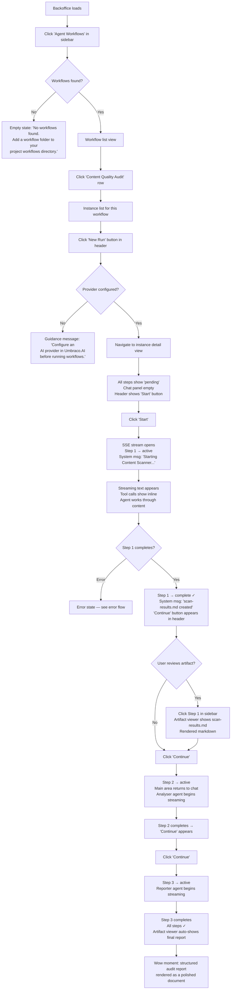
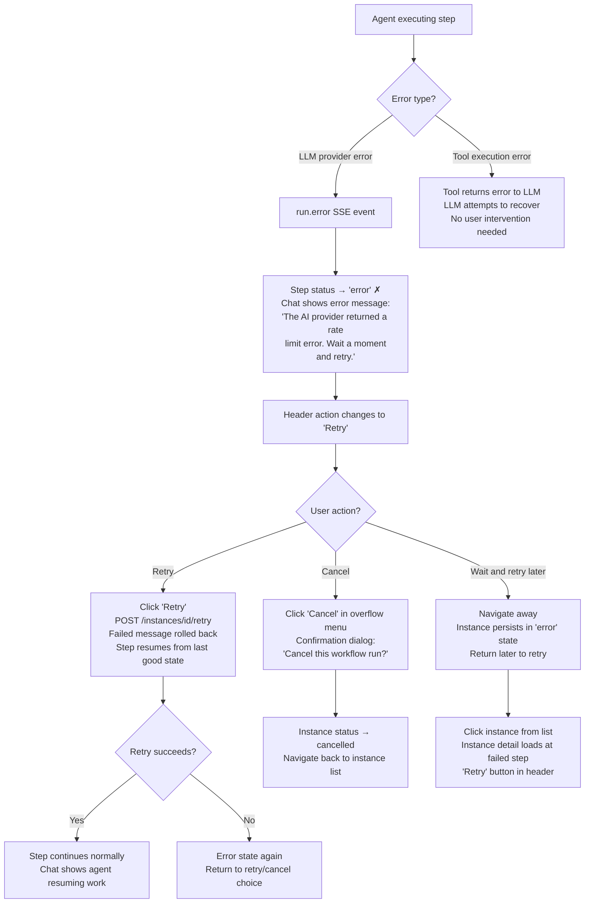
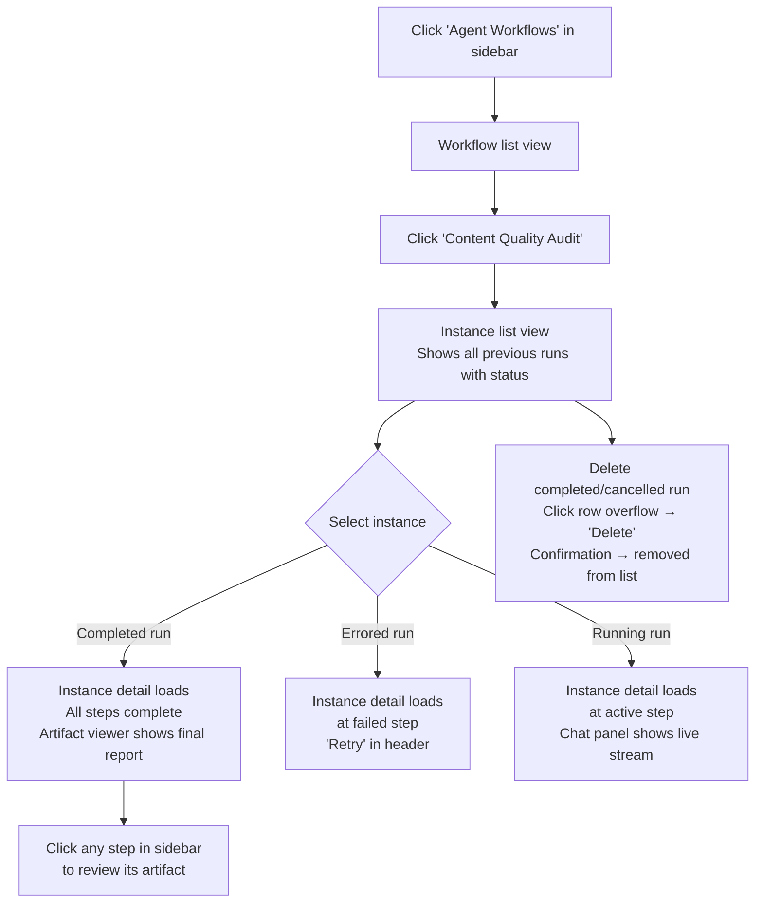

---
stepsCompleted:
  - "step-01-init"
  - "step-02-discovery"
  - "step-03-core-experience"
  - "step-04-emotional-response"
  - "step-05-inspiration"
  - "step-06-design-system"
  - "step-07-defining-experience"
  - "step-08-visual-foundation"
  - "step-09-design-directions"
  - "step-10-user-journeys"
  - "step-11-component-strategy"
  - "step-12-ux-patterns"
  - "step-13-responsive-accessibility"
  - "step-14-complete"
lastStep: 14
status: 'complete'
completedAt: '2026-03-28'
inputDocuments:
  - "prd.md"
  - "architecture.md"
---

# UX Design Specification — Shallai.UmbracoAgentRunner

**Author:** Adam
**Date:** 2026-03-28

---

<!-- UX design content will be appended sequentially through collaborative workflow steps -->

## Executive Summary

### Project Vision

Shallai.UmbracoAgentRunner brings multi-agent workflow orchestration to the Umbraco backoffice as a Bellissima dashboard extension. Workflows are defined as YAML + markdown folders — the engine is code, but every capability is configuration. The dashboard surfaces workflow execution through a chat interface with real-time SSE streaming, step-by-step progress tracking, and an artifact viewer for reviewing agent outputs.

The UX challenge is singular: make a technically sophisticated orchestration engine feel like a natural part of the Umbraco backoffice. UUI components and Bellissima conventions are not optional styling choices — they are the design system. The best outcome is indistinguishable from a first-party feature.

### Target Users

**Developer (Primary — Marcus archetype):** Mid-level Umbraco developer evaluating the package. Discovers via NuGet/Marketplace, gives it 30 minutes. Needs: clean dashboard discovery, instant "wow" from the example workflow, readable intermediate artifacts, obvious path to building custom workflows. Judges the package by code quality visible through UI polish and YAML schema clarity.

**Editor (Secondary — Sarah archetype):** Content manager who was told "there's a new tool in the backoffice." Zero technical knowledge. Needs: non-threatening UI with clear progress indication (step X of Y), human-readable agent messages, and a final deliverable she can act on. Every piece of jargon or raw technical output is a failure.

**Umbraco HQ (Tertiary — evaluator archetype):** Product/community team member assessing whether this is a serious contribution. Judges Bellissima convention adherence, IAIChatService integration correctness, and whether the UI looks native. The UX is their proxy for code quality.

### Key Design Challenges

**Dual-audience information density.** The chat panel and artifact viewer must serve both developers (who want tool call detail and step IDs) and editors (who want plain language summaries and progress). The solution is layered information — primary content is human-readable, technical detail is present but secondary (collapsible tool call blocks, step metadata in supporting positions).

**Real-time trust and orientation.** Streaming agent output creates excitement but also uncertainty. Users must always know: which step they're on, how many steps remain, whether the agent is working or waiting, and what they can do next. The step progress component and chat panel must synchronise to maintain constant spatial orientation.

**Bellissima constraint compliance.** Every component must use UUI elements, UUI design tokens, and follow backoffice layout conventions. Custom styling is a liability. The design specification must prescribe UUI components explicitly so implementing agents don't improvise.

### Design Opportunities

**Artifact viewer as value proof.** The rendered markdown artifact viewer transforms raw agent output into polished, readable documents. This is where the product's value becomes tangible — a structured audit report that looks like a professional deliverable, not a text dump.

**Step progress as narrative.** The sequential step model (scan → analyse → report) is inherently story-shaped. Clear step labels, status transitions, and per-step artifact previews turn a technical pipeline into a comprehensible narrative for all audiences.

**Chat as collaboration surface.** Users can message agents mid-step (FR41-42), creating genuine human-AI dialogue within a workflow engine. If the chat panel feels conversational rather than log-like, it delivers a qualitatively different experience from every other CMS AI feature.

## Core User Experience

### Defining Experience

The core experience is watching agents chain together in real-time. A user starts a workflow and observes streaming agent output in the chat panel — text appearing as the agent thinks, tool calls firing visibly, artifacts being written, and step completion triggering the next agent in the sequence. This is the product's "wow moment" and the interaction everything else exists to support.

The primary interaction loop is: **select workflow → start instance → watch agent stream → review artifact → advance step → repeat → receive final deliverable.** In autonomous mode, the middle steps collapse: the user starts the workflow and checks back when it's done.

### Platform Strategy

**Platform:** Umbraco Bellissima backoffice dashboard extension. Desktop browser only (Chrome, Edge, Firefox — standard Umbraco support matrix). Mouse and keyboard interaction. No mobile, offline, or touch considerations.

**Design system:** Umbraco UI (UUI) component library — 80+ Lit web components with built-in design tokens. All layout, typography, colour, spacing, and interactive elements use UUI components and CSS custom properties. No custom design system, no overrides. Bellissima convention adherence is a first-class requirement, not a polish item.

**Routing:** Internal sub-view routing via `umb-router-slot`. Three primary routes: workflow list (`/workflows`), instance list (`/workflows/{alias}`), and instance detail (`/instances/{id}`). Navigation follows standard Bellissima patterns — no custom navigation chrome.

**State management:** Umbraco Context API with `UmbObjectState` / `UmbArrayState` observables. Three contexts: WorkflowContext (available workflows), InstanceContext (instance list + active instance), ChatContext (SSE connection + message buffer). Components consume contexts via `this.observe()` from `UmbElementMixin`.

### Effortless Interactions

**Starting a workflow must be two clicks.** Click the workflow in the list. Click "Start." No configuration modal, no parameter selection, no "are you sure" confirmation. The workflow runs with the site's default profile. Advanced configuration (per-step profiles) is a workflow authoring concern, not a runtime concern.

**Progress must be self-evident.** The step progress bar and chat panel work in concert. At any moment the user can answer: "Which step am I on? How many are left? Is the agent working or waiting for me? What can I do right now?" without reading documentation or interpreting status codes.

**Artifact review must be inline.** Clicking a completed step shows its artifact rendered as markdown directly in the dashboard. No download, no new tab, no raw text. The artifact viewer is the value delivery surface — it must feel like reading a document, not inspecting an output file.

**Step advancement must be a single action.** In interactive mode, a prominent "Continue" button advances to the next step. No dropdown menus, no step selection, no confirmation modal. The user has already reviewed the artifact — the next action is obvious and singular.

**Chat input must be immediately available.** During active step execution, the message input is visible and ready. The user doesn't need to "open" a chat or switch modes — the agent is conversational by default, and the input field communicates that.

### Critical Success Moments

**First run completion (Marcus — 3 minutes).** The developer watches the example Content Quality Audit workflow execute 3 agents to completion. Streaming text, visible tool calls, step transitions, and a final rendered audit report. If this sequence feels confusing, slow, or broken at any point, the 30-minute evaluation window closes. The first run is the product demo — it must work flawlessly and feel impressive.

**Artifact readability (Sarah — the meeting test).** The editor opens the final audit report and sees structured, actionable content — page-by-page findings, prioritised recommendations, clear language. She can take this to a content planning meeting without translation. If the output looks like developer logs or raw markdown source, the editor journey fails.

**Step transition clarity (all users).** The moment between "step complete" and "next step active" must feel crisp and intentional. The step progress indicator updates, the completed step's artifact becomes reviewable, and in interactive mode the "Continue" button appears. In autonomous mode, the transition is automatic with a clear visual signal. Ambiguity during transitions destroys the pipeline narrative.

**First chat interaction (Marcus — the collaboration moment).** The developer sends a message to an agent mid-step and receives a contextual response. The agent didn't just acknowledge the message — it incorporated it into its work. This is the moment "batch job with a UI" becomes "interactive AI collaboration." The chat input affordance must make this interaction discoverable without documentation.

### Experience Principles

1. **The backoffice is the boundary.** Every component, token, pattern, and interaction follows Bellissima and UUI conventions. The dashboard should be indistinguishable from a first-party Umbraco feature. Deviations from platform conventions are bugs, not design choices.

2. **Show the work, don't explain it.** Users understand the pipeline by watching it execute, not by reading instructions. Streaming chat output, visible tool calls, step progress transitions, and inline artifact previews are the explanation. Tooltips and documentation are fallbacks, not the primary comprehension path.

3. **One action at a time.** At any point in the workflow lifecycle, there is exactly one primary action available: start, continue, retry, or review. The UI surfaces that single action prominently. Secondary actions (cancel, delete, view history) are available but never compete for attention.

4. **Layered information density.** Primary content (agent messages, step names, artifact text) is always human-readable. Technical detail (tool call parameters, step IDs, raw file paths) is present but secondary — collapsed by default, available on expansion. Both audiences are served without a mode toggle.

## Desired Emotional Response

### Primary Emotional Goals

**Fascination during execution.** The streaming chat panel creates a sense of watching structured intelligence at work. Agents don't just produce output — they visibly think, use tools, write files, and build on each other's work. The primary emotional response during execution is leaning-forward curiosity: "what's it doing now?"

**Calm confidence during navigation.** At no point should a user feel lost, confused, or uncertain about what to do next. The step progress indicator, clear status labels, and single-action controls create a sense of being guided through a predictable, comprehensible process. The dashboard feels like a well-marked trail, not an unmarked wilderness.

**Competence on completion.** The final artifact makes the *user* look capable, not the tool. Sarah takes the audit report to her meeting and it reflects well on her. Marcus shows the output to his team lead and it demonstrates what's possible. The emotional payoff is "I produced something valuable" — the tool is invisible, the output is everything.

### Emotional Journey Mapping

| Moment | Target Emotion | Anti-Pattern to Avoid |
|--------|---------------|----------------------|
| First dashboard load | Clarity — "I know what this does and how to start" | Overwhelm — too many options, unclear entry point |
| Workflow selection | Anticipation — "this is going to do something useful" | Hesitation — "will this break something? what does this cost?" |
| Agent streaming begins | Fascination — "it's working, I can see it thinking" | Anxiety — "is it stuck? is this right? when will it stop?" |
| Tool call visible | Understanding — "ah, it's writing a file / reading content" | Confusion — "what's FunctionCallContent? what's tc_001?" |
| Step completion | Satisfaction — "that step is done, I can see what it produced" | Uncertainty — "did it work? what happened? where's the output?" |
| Step advancement (interactive) | Control — "I decide when to proceed" | Impatience — "why do I have to click? just keep going" |
| Error occurs | Informed composure — "I know what went wrong and what to do" | Alarm — stack trace, cryptic code, spinner that never stops |
| Final artifact rendered | Competence — "I have something valuable and actionable" | Disappointment — "that's it? I can't use this" |
| Return visit | Familiarity — "I know exactly where everything is" | Disorientation — "what was I doing? where's my previous run?" |

### Micro-Emotions

**Confidence over confusion.** Every status label, every button label, every progress indicator reinforces "you're in the right place, doing the right thing." Confusion is the most destructive micro-emotion for this product — one moment of "wait, what?" during the first run and Marcus closes the tab.

**Trust over scepticism.** The streaming output builds trust incrementally. Each visible tool call, each artifact write, each step completion is a trust deposit. The user doesn't need to trust the AI blindly — they can *see* it working correctly. Transparency is the trust mechanism.

**Excitement over anxiety.** Real-time streaming can trigger either emotion. The difference is context: if the user knows where they are (step progress), what's happening (readable messages), and what comes next (clear step labels), streaming creates excitement. Without that context, the same streaming creates anxiety.

### Design Implications

| Emotional Goal | UX Design Choice |
|---------------|-----------------|
| Fascination during streaming | Chat messages appear character-by-character via SSE `text.delta` events. Tool calls render as compact, readable blocks (tool name + brief result) rather than raw JSON. The panel scrolls automatically to follow new content. |
| Calm confidence in navigation | Step progress uses `uui-tab-group` or equivalent with clear labels, step numbers, and status icons. Current step is visually distinct. Completed steps show a check. The user's position is never ambiguous. |
| Competence on completion | Artifact viewer renders markdown with proper heading hierarchy, lists, tables, and emphasis. Content looks like a document, not a code preview. No monospace font for body text. |
| Informed composure on error | Error states use `uui-badge` with "danger" colour and plain-language messages. "Retry" button appears immediately. The error message explains what happened and what the user can do — never just an error code. |
| Control in interactive mode | "Continue to Next Step" button uses `uui-button` with `look="primary"`. It appears only when the current step is complete. It's the most prominent element on screen at that moment. |
| Trust through transparency | Tool call blocks show the tool name and a one-line summary of what happened. Expandable for full detail. The user can verify the agent did what it claimed without being forced to read raw data. |

### Emotional Design Principles

1. **Predictability is comfort.** The step-by-step pipeline is inherently predictable — lean into this. Users should always be able to predict what happens next. Surprises in a workflow engine feel like bugs, not features.

2. **Transparency builds trust faster than polish.** Users trust what they can see working. Visible streaming, visible tool calls, visible artifact creation — every transparent moment is a trust deposit. A polished loading spinner with no information is a trust withdrawal.

3. **Errors are conversations, not failures.** When something goes wrong, the UI's tone shifts to helpful and specific. "The AI provider returned a rate limit error. Wait a moment and retry, or check your Umbraco.AI provider configuration." The user is never left wondering what happened or what to do.

4. **The output is the hero, not the tool.** The dashboard never draws attention to itself. The artifact viewer, the final report, the actionable deliverable — that's what the user cares about. The tool's job is to be a reliable, invisible conduit between the user's intent and a valuable output.

## UX Pattern Analysis & Inspiration

### Inspiring Products Analysis

**Umbraco Bellissima Backoffice — the native benchmark.**
The backoffice is not inspiration — it's the constraint. But specific patterns inform the dashboard design: the section sidebar for top-level navigation, `umb-body-layout` for workspace structure with a header bar and action buttons, `uui-box` for content grouping, `uui-table` for list views, and `uui-badge` for status indicators. The backoffice uses a consistent pattern of list → detail navigation where clicking an item in a list navigates to a detail workspace. The Agent Workflows dashboard must follow this exact pattern: workflow list → instance list → instance detail.

**ChatGPT / Claude.ai — the streaming conversation benchmark.**
Users have a strong mental model for AI chat: messages appear in a vertical stream, the AI's response builds character by character, tool usage is shown inline, and the input field sits at the bottom. Key patterns to adopt: auto-scrolling during streaming, visual distinction between user and agent messages, inline tool call indicators, and a persistent input field. Key pattern to adapt: these products are open-ended conversation — our chat panel is *scoped to a workflow step*, with a clear beginning (step starts) and end (step completes). The chat panel must communicate this bounded scope.

**GitHub Actions — the pipeline progress benchmark.**
GitHub Actions surfaces multi-step workflows with clear UX patterns: a vertical step list with status icons (queued, in progress, success, failure), expandable log output per step, re-run controls for failed steps, and timing information. Key patterns to adopt: status iconography (pending dot, spinning indicator, green check, red cross), step-level expandability, and retry affordances. Key pattern to adapt: GitHub Actions shows raw logs — our step detail shows rendered artifacts and a chat conversation, not a log dump.

### Transferable UX Patterns

**Navigation: List → Detail drill-down (Bellissima pattern).**
Workflow list → click workflow → instance list → click instance → instance detail. This is the standard Bellissima content navigation model. Users navigate deeper with each click and use breadcrumbs or the back button to return. No tabs-within-tabs, no split panels, no modal workflows.

**Progress: Vertical step list with status icons (GitHub Actions pattern).**
A vertical list of steps with their names and status icons. Current step is visually prominent (active colour, spinner). Completed steps show a check mark and become clickable to review artifacts. Failed steps show a cross and offer retry. This pattern communicates pipeline progress at a glance.

**Streaming: Character-by-character text with auto-scroll (ChatGPT pattern).**
Agent responses stream into the chat panel as `text.delta` SSE events. The panel auto-scrolls to follow new content. When the user scrolls up to review earlier messages, auto-scroll pauses. When the user scrolls back to the bottom, auto-scroll resumes. This is the established streaming UX pattern users expect.

**Tool calls: Inline collapsible blocks (Claude.ai pattern).**
Tool calls appear inline in the chat stream as compact blocks: an icon, the tool name, and a one-line summary. Clicking expands to show full parameters and results. This gives editors the "agent is doing something" signal without overwhelming them with technical detail, while giving developers the full picture on demand.

**Actions: Single primary action in header (Bellissima pattern).**
The instance detail workspace header shows the single most relevant action as a primary button: "Start" (pending), "Continue" (step complete, interactive mode), "Retry" (step failed). Secondary actions (cancel, delete) live in a `...` overflow menu or as ghost buttons. This follows Bellissima's workspace header action pattern.

### Anti-Patterns to Avoid

**Log dump chat panel.** GitHub Actions shows raw ANSI logs. ChatGPT shows polished conversation. The chat panel must be a *conversation*, not a log viewer. Raw tool call JSON, unformatted function parameters, and internal step IDs in the message stream would make this feel like a developer console, not a user tool.

**Tab overload.** Some dashboards try to show everything at once: tabs for chat, tabs for artifacts, tabs for settings, tabs for history. The instance detail view has three components (step progress, artifact viewer, chat panel) — these should be arranged spatially in a single view, not hidden behind tabs. The user should see progress, output, and conversation simultaneously.

**Confirmation dialog on every action.** "Are you sure you want to start this workflow?" "Are you sure you want to advance to the next step?" These add friction without adding safety — starting a workflow has no destructive consequences, and advancing a step is the expected next action. Reserve confirmation dialogs for destructive actions only: cancel a running workflow, delete an instance.

**Invisible streaming state.** A blank panel with a spinner and no indication of what's happening. The moment between "user clicks Start" and "first streaming text appears" is critical — there must be an immediate visual response (step status changes to "active," chat panel shows a "Starting scanner agent..." system message) even before the LLM begins generating.

**Over-designed empty states.** Large illustrations and marketing copy for "no workflows found" or "no instances yet." This is a developer tool. A simple message with the next action is sufficient: "No workflows found. Add a workflow folder to your project's workflows directory."

### Design Inspiration Strategy

**Adopt directly:**
- Bellissima list → detail navigation model (non-negotiable, it's the platform)
- Bellissima workspace header with primary action button
- ChatGPT-style auto-scrolling streaming chat with bottom-pinned input
- GitHub Actions-style vertical step list with status iconography
- Claude.ai-style collapsible inline tool call blocks

**Adapt for context:**
- Chat panel is step-scoped, not open-ended — add clear step boundary indicators (system messages for step start/complete)
- Step list shows artifacts not logs — clicking a completed step shows rendered markdown, not raw output
- Pipeline progress is simpler than CI (linear steps, no parallel jobs) — the step list can be a clean vertical progression without the complexity of dependency graphs

**Avoid entirely:**
- Raw log/console aesthetic in any user-facing component
- Modal workflows or confirmation dialogs for non-destructive actions
- Tab-based layout that hides the chat panel or artifact viewer
- Custom navigation chrome that deviates from Bellissima patterns
- Marketing-style empty states or onboarding wizards

## Design System Foundation

### Design System Choice

**Umbraco UI (UUI) — mandatory platform design system.** There is no design system "choice" for a Bellissima dashboard extension. UUI is the component library, the design token system, and the interaction pattern reference. All dashboard components consume UUI elements via Shadow DOM composition. Custom styling is limited to layout composition and component arrangement — visual properties (colour, typography, spacing, borders) use UUI design tokens exclusively.

UUI provides 80+ Lit web components built on the same design language as the Umbraco backoffice. Components include layout primitives (`uui-box`, `uui-tab-group`), form elements (`uui-button`, `uui-input`, `uui-textarea`), feedback elements (`uui-badge`, `uui-loader`, `uui-icon`), and data display elements (`uui-table`, `uui-card`). The Bellissima backoffice itself provides additional higher-level elements (`umb-body-layout`, `umb-router-slot`, `umb-workspace-action`) that define workspace structure.

### Rationale for Selection

- **Platform mandate.** Bellissima extensions that don't use UUI look broken. The backoffice has a consistent visual language, and extensions that deviate are immediately identifiable as third-party — which undermines the "looks native" requirement from the HQ evaluation journey.
- **Accessibility built-in.** UUI components ship with keyboard navigation, ARIA labels, focus management, and screen reader support (NFR14-15). Using UUI means accessibility compliance is inherited, not implemented.
- **Design tokens for theming.** UUI uses CSS custom properties (`--uui-color-*`, `--uui-size-*`, `--uui-font-*`) that automatically respect the user's backoffice theme. Dark mode, high contrast, custom themes — all handled by the token system.
- **Zero maintenance burden.** UUI evolves with Umbraco. When Bellissima updates its design language, packages using UUI components update automatically. Custom-styled components would need manual maintenance on every Umbraco version.

### Implementation Approach

**Component mapping — UUI elements for each dashboard component:**

| Dashboard Component | Primary UUI Elements |
|---|---|
| `shallai-dashboard` | `umb-body-layout`, `umb-router-slot` |
| `shallai-workflow-list` | `uui-table`, `uui-badge`, `uui-button` |
| `shallai-instance-list` | `uui-table`, `uui-badge`, `uui-button`, `uui-icon` |
| `shallai-instance-detail` | `umb-body-layout` (nested), `uui-box` for content sections |
| `shallai-step-progress` | `uui-icon` (status), `uui-badge` (step status), `uui-button` (advance) |
| `shallai-chat-panel` | `uui-scroll-container`, `uui-icon`, `uui-textarea`, `uui-button` |
| `shallai-artifact-viewer` | `uui-box`, `uui-scroll-container` |

**Custom elements (not in UUI, must be built):**
- Chat message bubbles — no UUI chat component exists. Build using `uui-box` with role-based styling (agent vs user vs system). Use `--uui-color-surface` variants for visual distinction.
- Tool call blocks — collapsible inline indicators for tool activity. Build using `uui-icon` + custom expand/collapse with `--uui-color-border` tokens.
- Markdown renderer — sanitised markdown to HTML within `uui-box`. Use UUI typography tokens for headings, paragraphs, lists, and tables.
- Streaming text indicator — a subtle animation or cursor to show text is actively streaming. Keep minimal — a blinking cursor or `uui-loader-bar` at the bottom of the active message.

### Customisation Strategy

**No visual customisation.** The design system is UUI, used as-is. No custom colour palette, no custom typography, no custom spacing scale. The only "customisation" is component composition — how UUI elements are arranged within each dashboard component's Shadow DOM.

**Layout composition rules:**
- Use `umb-body-layout` for workspace-level structure (header + content area)
- Use `uui-box` for content grouping within views
- Use CSS Grid or Flexbox for spatial arrangement of child components — the instance detail view arranges step progress, artifact viewer, and chat panel using CSS layout, not UUI layout components
- Use `--uui-size-layout-*` tokens for spacing between sections
- Use `--uui-size-space-*` tokens for padding within components

**Design token categories in use:**

| Token Category | Usage |
|---|---|
| `--uui-color-text` | All text content |
| `--uui-color-surface` | Background colours for boxes, panels, message bubbles |
| `--uui-color-border` | Borders, dividers, tool call block outlines |
| `--uui-color-interactive` | Clickable elements, links |
| `--uui-color-positive` | Completed step indicators, success states |
| `--uui-color-danger` | Error states, failed step indicators |
| `--uui-color-warning` | Warning messages |
| `--uui-color-current` | Active/current step highlight |
| `--uui-size-layout-*` | Section spacing |
| `--uui-size-space-*` | Internal padding |
| `--uui-font-*` | Typography (size, weight, family) |

## Defining Experience

### The Core Interaction

"Watch AI agents chain together and build a deliverable, step by step, inside the Umbraco backoffice."

This is a *spectator-then-collaborator* pattern. The user initiates, then watches, then optionally intervenes, then receives. It's closer to watching a build pipeline execute than to using a productivity tool — but with the added dimension that the user can talk to the agents as they work.

The defining moment isn't any single screen or component. It's the *transition*: Step 1 completes, its artifact appears, and Step 2 begins — visibly picking up where Step 1 left off. That handoff is where "three separate AI calls" becomes "a pipeline that builds something." If the transition feels seamless, the product works. If it feels disconnected, it's just a chat interface with extra steps.

### User Mental Model

**Developer mental model:** "This is like GitHub Actions but for AI tasks." Developers understand pipelines — steps execute sequentially, each reads the previous step's output, status indicators show progress. They expect: a list of steps with status icons, expandable detail per step, and the ability to re-run failed steps. The novelty is that the "logs" are a conversation and the "build artifacts" are structured documents.

**Editor mental model:** "This is like asking three specialists to work on my content, one after another." Editors don't think in pipelines — they think in delegation. "First someone scans, then someone analyses, then someone writes the report." They expect: clear step names that describe *what's happening* (not technical IDs), visible progress ("2 of 3 complete"), and a final output they can read and use. The chat panel is "watching the specialist work."

**Shared mental model gap:** Neither audience has a strong prior for "AI agents passing artifacts to each other inside a CMS." The UX must bridge this by making the pattern self-evident through the interface — step labels that tell a story, artifacts that are clearly linked to steps, and transitions that make the handoff visible.

### Success Criteria

| Criterion | Measurable Indicator |
|---|---|
| **Instant orientation** | Within 5 seconds of landing on instance detail, the user can state which step is active, how many steps total, and whether the agent is working or waiting |
| **Zero-instruction first run** | A user runs the example workflow and reaches the final artifact without reading documentation or asking "what do I do next?" |
| **Artifact comprehension** | The final audit report is understandable to a non-technical content manager without translation or explanation |
| **Chat discoverability** | Within the first workflow run, the user notices the input field and understands they can message the agent — without a tooltip or tutorial |
| **Step transition clarity** | Users can describe the handoff ("the scanner found the pages, then the analyser scored them") without being told how artifacts pass between steps |
| **Error recovery confidence** | When a step fails, the user knows what happened and what to do within 3 seconds of seeing the error state |

### Pattern Analysis — Established with a Novel Twist

**Established patterns (no user education needed):**
- List → detail navigation (Bellissima native)
- Chat interface with streaming text (ChatGPT/Claude mental model)
- Step progress with status icons (CI/CD pipeline mental model)
- Primary action button in header (standard workspace pattern)
- Markdown document rendering (universal)

**Novel combination (the product's UX innovation):**
- Chat + pipeline progress + artifact viewer *in a single view*. No existing product combines real-time AI conversation, multi-step pipeline progress, and inline document rendering in one workspace. This is the novel UX — not any single component, but their spatial co-presence. The user watches the chat, glances at the step progress, and clicks to review an artifact — all without navigating away.

**Teaching strategy:** The interface teaches itself. Step names tell the story ("Content Scanner" → "Quality Analyser" → "Report Generator"). The chat panel shows work happening. The artifact viewer shows results. No onboarding wizard, no tutorial overlay, no "Getting Started" modal. The example workflow *is* the tutorial — running it teaches the user how the product works.

### Experience Mechanics

**1. Initiation — Starting a workflow run:**
- User is on the workflow list view (`shallai-workflow-list`)
- Clicks a workflow row → navigates to instance list (`shallai-instance-list`)
- Clicks "New Run" button (primary, in header) → POST `/instances` creates instance → navigates to instance detail (`shallai-instance-detail`)
- Instance detail loads showing: step progress (all steps pending), empty chat panel, empty artifact viewer
- Primary action button in header: **"Start"**
- User clicks Start → POST `/instances/{id}/start` → SSE stream opens → step 1 status changes to "active" → chat panel shows system message "Starting Content Scanner..." → streaming text begins

**2. Interaction — Watching and collaborating during execution:**
- Chat panel streams `text.delta` events as the agent works
- Tool calls appear inline: `tool.start` shows "Using read_file..." → `tool.end` shows summary → expandable for detail
- Step progress shows step 1 as active (spinner icon, highlighted)
- User can scroll up in chat to review earlier messages — auto-scroll pauses
- User can type a message in the input field → POST `/instances/{id}/message` → agent receives and responds in context
- The input field is always visible during active execution — no "open chat" action needed

**3. Feedback — Knowing it's working:**
- Streaming text is the primary feedback — if text is appearing, the agent is working
- Between tool calls, a subtle streaming indicator (blinking cursor or `uui-loader-bar`) confirms the agent is still processing
- Step progress updates in real-time: pending → active → complete
- System messages mark boundaries: "Content Scanner started", "Content Scanner completed — scan-results.md created"
- When a step completes, the artifact becomes clickable in the step progress or artifact viewer

**4. Completion — Step transition and final output:**
- `step.finished` SSE event → step status changes to "complete" (green check icon)
- System message in chat: "Step complete. Output: scan-results.md"
- **Interactive mode:** "Continue to Next Step" button appears as primary action in header. User clicks to review artifact first (optional) or advances immediately. POST `/instances/{id}/start` begins next step.
- **Autonomous mode:** Engine auto-advances after completion check passes. Brief system message "Auto-advancing to Quality Analyser..." → next step begins streaming. User watches the full pipeline without intervention.
- **Final step completion:** All steps show complete. Primary action changes to "View Report" or equivalent. Artifact viewer shows the final deliverable rendered as markdown. Chat panel shows "Workflow complete."

## Visual Design Foundation

### Colour System

**UUI provides the entire colour system.** There is no custom palette. All colour values are consumed via CSS custom properties that respect the user's backoffice theme.

**Semantic colour mapping for dashboard components:**

| Purpose | Token | Usage Context |
|---|---|---|
| Body text, labels | `--uui-color-text` | All readable content |
| Secondary/muted text | `--uui-color-text-alt` | Timestamps, step metadata, secondary labels |
| Panel backgrounds | `--uui-color-surface` | Chat panel, artifact viewer, card backgrounds |
| Elevated surfaces | `--uui-color-surface-emphasis` | Active message bubble, focused input |
| Borders and dividers | `--uui-color-border` | Between chat messages, around tool call blocks, section dividers |
| Interactive/clickable | `--uui-color-interactive` | Clickable step names, artifact links |
| Interactive hover | `--uui-color-interactive-emphasis` | Hover state on clickable elements |
| Active/current step | `--uui-color-current` | Highlighted active step in progress indicator |
| Completed/success | `--uui-color-positive` | Step complete checkmark, success badges |
| Error/failed | `--uui-color-danger` | Failed step indicator, error messages, error badges |
| Warning | `--uui-color-warning` | Rate limit warnings, non-critical alerts |
| Disabled/pending | `--uui-color-disabled` | Pending step icons, disabled buttons |

**Chat message role colours:**
- Agent messages: `--uui-color-surface` background (default surface — blends with panel)
- User messages: `--uui-color-surface-emphasis` background (slightly elevated — visually distinct)
- System messages: No background, `--uui-color-text-alt` text colour, smaller font — these are status markers, not conversation

**Status icon colours:**
- Pending: `--uui-color-disabled` (grey dot)
- Active: `--uui-color-current` (blue/accent spinner)
- Complete: `--uui-color-positive` (green checkmark)
- Error: `--uui-color-danger` (red cross)

### Typography System

**UUI's type scale is the only type scale.** All text uses `--uui-font-*` tokens. No custom font faces, no custom sizes.

**Typography usage by component:**

| Context | Token / Approach | Notes |
|---|---|---|
| View headings (e.g. "Content Quality Audit") | `uui-h3` or equivalent heading element | Workspace title in `umb-body-layout` header |
| Step names in progress | `--uui-font-size-s` with `--uui-font-weight-bold` | Compact but readable in the step list |
| Chat agent messages | `--uui-font-size-default` | Standard body text — readable, proportional |
| Chat user messages | `--uui-font-size-default` | Same size as agent — equal visual weight |
| Chat system messages | `--uui-font-size-s`, `--uui-color-text-alt` | Smaller, muted — these are annotations, not conversation |
| Tool call labels | `--uui-font-size-s`, `--uui-font-weight-bold` | "read_file" — compact, identifiable |
| Tool call detail (expanded) | `--uui-font-size-s`, `font-family: monospace` | Parameters and results — monospace is appropriate here |
| Artifact rendered markdown | UUI typography tokens for h1-h6, p, li, td | Rendered markdown must use proportional font for body, heading hierarchy via UUI tokens |
| Timestamps | `--uui-font-size-xs`, `--uui-color-text-alt` | Smallest text in the interface — time metadata |
| Badges and labels | Inherited from `uui-badge` component | Component handles its own typography |

**Key rule:** Monospace font is *only* used inside expanded tool call detail blocks and inline code within rendered markdown. All other text is proportional. The chat panel is a conversation, not a terminal.

### Spacing & Layout Foundation

**Spacing tokens:** All spacing uses `--uui-size-space-*` (internal) and `--uui-size-layout-*` (between sections).

**Instance detail layout — the critical composition:**

The instance detail view (`shallai-instance-detail`) is the most complex layout. It arranges three child components in a single workspace:

```
┌─────────────────────────────────────────────────────┐
│  umb-body-layout header                             │
│  [← Back]  Content Quality Audit — Run #3  [Action] │
├──────────────┬──────────────────────────────────────┤
│              │                                      │
│  Step        │  Main content area                   │
│  Progress    │                                      │
│              │  ┌──────────────────────────────────┐ │
│  ● Scanner   │  │  Chat Panel                     │ │
│  ○ Analyser  │  │  (or Artifact Viewer)            │ │
│  ○ Reporter  │  │                                  │ │
│              │  │  Messages stream here...          │ │
│              │  │                                  │ │
│              │  │                                  │ │
│              │  │                                  │ │
│              │  ├──────────────────────────────────┤ │
│              │  │  [Message input]         [Send]  │ │
│              │  └──────────────────────────────────┘ │
├──────────────┴──────────────────────────────────────┤
│  (footer area if needed)                            │
└─────────────────────────────────────────────────────┘
```

- **Left sidebar:** Step progress — narrow column (~200-240px), vertical step list. Uses `uui-box` or simple flex column.
- **Main content area:** Chat panel during execution, artifact viewer when reviewing completed steps. Fills remaining width. Flex-grow.
- **Layout method:** CSS Grid with `grid-template-columns: auto 1fr` or Flexbox row. Gap uses `--uui-size-layout-1`.
- **Chat panel internal spacing:** Messages spaced with `--uui-size-space-3`. Input area pinned to bottom with `--uui-size-space-4` padding.
- **Step progress internal spacing:** Steps spaced with `--uui-size-space-4`. Each step is a row: status icon + step name + optional badge.

**Workflow list and instance list layouts:**
- Standard `uui-table` — no custom layout needed. Table rows with columns for name, status, step count, timestamps.
- Action buttons in `umb-body-layout` header.

**Responsive behaviour:** None. This is a desktop backoffice tool. The layout assumes a minimum viewport of ~1024px (standard Umbraco backoffice assumption). No mobile breakpoints, no responsive column collapse.

### Accessibility Considerations

**Inherited from UUI:** Keyboard navigation, focus management, ARIA labels on interactive elements, colour contrast compliance — all provided by UUI components.

**Custom component accessibility requirements:**

| Custom Element | Accessibility Need |
|---|---|
| Chat message list | `role="log"`, `aria-live="polite"` — screen readers announce new messages without interrupting. `aria-label="Agent conversation"` on the container |
| Chat input | `aria-label="Message to agent"` on the textarea. Submit via Enter key (with Shift+Enter for newlines) |
| Tool call blocks | `role="group"`, `aria-label="Tool call: {tool_name}"`. Expand/collapse via keyboard (Enter/Space). `aria-expanded` state |
| Step progress list | `role="list"` with `role="listitem"` per step. `aria-current="step"` on active step. Status communicated via `aria-label` (e.g. "Step 1: Content Scanner — complete") |
| Artifact viewer | Rendered markdown inherits semantic HTML (h1-h6, p, ul, table). No additional ARIA needed if semantic structure is correct |
| Streaming indicator | `aria-live="polite"` region that announces "Agent is responding..." during streaming, "Agent response complete" when done |

**Keyboard navigation flow:** Tab through step progress list → tab to chat message area → tab to input field → tab to send button → tab to header actions. Focus must be visible (UUI handles focus ring styling via `--uui-color-focus`).

## Design Direction Decision

### Design Directions Explored

Three layout compositions were evaluated for the instance detail view — the only genuinely variable design surface in a UUI-constrained dashboard extension. All three use identical UUI components, tokens, and styling. The differentiator is spatial arrangement of the three custom sub-components (step progress, chat panel, artifact viewer).

**Direction A — Sidebar + Main (selected):** Step progress as persistent left sidebar (~200-240px). Main content area switches between chat panel (during execution) and artifact viewer (when reviewing completed step output). Single focal point.

**Direction B — Sidebar + Split Main:** Three-column layout with step progress, artifact viewer, and chat panel all visible simultaneously. Higher information density but split attention. Deferred to v2 consideration if user feedback indicates need for simultaneous chat + artifact viewing.

**Direction C — Top Progress + Full-Width Main:** Horizontal step progress bar above a full-width main area. More space for chat/artifacts but step progress becomes a compact bar that doesn't accommodate step names well beyond 3-4 steps.

### Chosen Direction

**Direction A — Sidebar + Main.** Single main content area that switches between chat panel and artifact viewer, with a persistent step progress sidebar.

### Design Rationale

1. **Simplicity of implementation.** Two-region layout (sidebar + main) is straightforward CSS Grid or Flexbox. Fewer layout regions mean fewer edge cases and less to test.
2. **Cognitive clarity.** One focal point at a time. During execution, the user watches the chat. After a step completes, they click to review the artifact. They're never split between two active content areas.
3. **"One action at a time" principle.** The main area always shows the most relevant content for the current state. Active step → chat panel. Completed step review → artifact viewer. This aligns with the experience principle established earlier.
4. **Scalability.** Vertical step progress sidebar accommodates workflows from 2 to 10+ steps without layout strain. Horizontal bars (Direction C) compress at scale.
5. **GitHub Actions familiarity.** Developer audience recognises the left sidebar + main content pattern from CI/CD pipeline dashboards.
6. **v2 expansion path.** Direction B (three columns) can be offered as a "split view" toggle in future versions without rebuilding the core layout. The sidebar + main foundation supports progressive enhancement.

### Implementation Approach

**Instance detail layout (`shallai-instance-detail`):**

```css
:host {
  display: grid;
  grid-template-columns: 240px 1fr;
  gap: var(--uui-size-layout-1);
  height: 100%;
}
```

**Main area content switching:**
- Managed by component state: `activeView: 'chat' | 'artifact'`
- Default: `'chat'` when a step is active or no step has been reviewed
- Switches to `'artifact'` when user clicks a completed step in the sidebar
- Returns to `'chat'` when user clicks the active step, clicks a "Back to conversation" link, or a new step begins executing
- Transition is instant (conditional rendering) — no animation, no slide. State swap.

**Step progress sidebar click behaviour:**
- Click active step → show chat panel (if not already showing)
- Click completed step → show that step's artifact in the artifact viewer
- Click pending step → no action (step hasn't executed yet)
- Visual feedback: clicked/selected step has `--uui-color-current` indicator

**Workflow list and instance list views** use standard `uui-table` layouts — no direction decision needed. These are straightforward list views following Bellissima conventions.

## User Journey Flows

### Journey 1: Developer First Run — "Install to Wow in 30 Minutes"

**Entry point:** Marcus opens the Umbraco backoffice after installing the NuGet package. He sees "Agent Workflows" in the section sidebar.



**Key UX decisions in this flow:**
- Provider prerequisite check happens on instance creation (POST `/instances`), not on dashboard load — don't block browsing
- "Start" is a single button, not a form — no parameters for v1
- Chat panel is the default main area view until the user explicitly clicks a completed step
- After final step, artifact viewer auto-activates to show the final report — the deliverable is the payoff, present it immediately

### Journey 2: Editor Workflow Execution — "Dashboard to Deliverable"

**Entry point:** Sarah is told "there's a content audit tool in the backoffice now." She finds it in the sidebar.

```mermaid
flowchart TD
    A[Click 'Agent Workflows' in sidebar] --> B[Workflow list view]
    B --> C[Sees 'Content Quality Audit'<br/>with description: 'Scans, analyses,<br/>and reports on content quality']
    C --> D[Click workflow row]
    D --> E[Instance list view<br/>May see previous runs by colleagues]
    E --> F[Click 'New Run']
    F --> G[Instance detail view<br/>Steps: Scanner → Analyser → Reporter<br/>All pending]
    G --> H[Click 'Start']
    H --> I[System msg: 'Starting Content Scanner...'<br/>Step 1 active with spinner]
    I --> J[Chat streams: 'Scanning Homepage...<br/>Scanning About Us...<br/>Scanning Blog section...']
    J --> K[Step 1 complete ✓<br/>'Continue' button appears]
    K --> L{Sarah wants to check output?}
    L -->|Curious| M[Clicks 'Scanner' step in sidebar<br/>Sees scan summary — pages found,<br/>content catalogued]
    L -->|Trusts it| N[Clicks 'Continue']
    M --> N
    N --> O[Step 2 active<br/>Chat: 'Analysing page quality...<br/>Scoring SEO completeness...<br/>Checking readability...']
    O --> P[Step 2 complete ✓<br/>'Continue' button appears]
    P --> Q[Clicks 'Continue']
    Q --> R[Step 3 active<br/>Chat: 'Generating prioritised<br/>action plan...']
    R --> S[Step 3 complete ✓<br/>All steps done<br/>Artifact viewer shows final report]
    S --> T["Sarah reads: 'Homepage missing<br/>meta description. 12 blog images<br/>lack alt text. About page<br/>readability score: 45/100.'"]
    T --> U["Takes report to content<br/>planning meeting"]
```



**Key UX decisions for the editor flow:**
- Workflow descriptions must be in plain language — "Scans, analyses, and reports on content quality" not "3-step YAML pipeline with artifact handoff"
- Step names must be human labels — "Content Scanner," "Quality Analyser," "Report Generator" — not technical IDs
- Chat messages from agents should read as natural language progress updates, not log entries
- The "Continue" button label is always "Continue" — not "Advance to Step 2" or "Execute Next Agent"
- No technical metadata visible by default — no step IDs, no profile names, no instance UUIDs in the primary UI

### Journey 3: Error Recovery — "Something Went Wrong"

**Entry point:** During any step execution, the LLM provider returns an error (rate limit, timeout, API failure).



**Key UX decisions for error recovery:**
- Error messages are always plain language with a suggested action — never just an error code
- "Retry" replaces the primary action button — it's the obvious next thing to do
- Cancel requires confirmation (it's the one destructive action in the workflow lifecycle)
- Navigating away from an errored instance is safe — state persists, user can return
- Tool execution errors are handled by the LLM (returned as error results in context) — these don't surface as error states to the user unless the LLM itself fails to recover

### Journey 4: Returning to a Previous Run



### Journey Patterns

**Pattern: Progressive disclosure of state.**
The user starts at a high level (workflow list) and drills deeper (instance list → instance detail → step artifact). At each level, they see only what's relevant: workflow list shows names and step counts, instance list shows statuses and timestamps, instance detail shows the full execution state. Information density increases with depth.

**Pattern: Single primary action.**
At every view, exactly one action is primary: workflow list → click a workflow. Instance list → "New Run." Instance detail → "Start" / "Continue" / "Retry." The primary action is always in the header, always uses `uui-button look="primary"`, and always represents the most likely next step.

**Pattern: Status as visual language.**
Four states, four colours, four icons — used consistently everywhere: pending (grey dot), active (accent spinner), complete (green check), error (red cross). The same visual language appears in the step progress sidebar, the instance list status column, and the chat system messages. Users learn it once and recognise it everywhere.

**Pattern: Non-destructive by default.**
Starting a workflow, advancing a step, retrying an error, reviewing an artifact, navigating away — all non-destructive, all reversible or resumable. Only cancel and delete are destructive, and both require confirmation. A user can never accidentally lose work by clicking the wrong thing.

### Flow Optimisation Principles

1. **Minimise clicks to value.** From dashboard to streaming first agent: 4 clicks (sidebar → workflow → New Run → Start). From first visit to reading the final report: 4 clicks + wait time. Every additional click is a potential drop-off in the 30-minute evaluation window.

2. **Auto-present the payoff.** When the final step completes, the artifact viewer automatically shows the final report. The user doesn't need to click "view results" — the value is delivered without asking. For intermediate steps, the user opts in to review by clicking the step.

3. **Persist everything, lose nothing.** Navigating away from a running workflow doesn't stop it. Closing the browser doesn't lose state. Errors don't corrupt the instance. The user can always come back, always pick up where they left off. This eliminates the anxiety of "if I leave, will I lose my progress?"

4. **Errors are speed bumps, not dead ends.** Every error state has exactly one forward action (retry) and one escape action (cancel). The error message tells the user what happened and what to do. No error state leaves the user stuck without a clear next action.

## Component Strategy

### Design System Components — UUI Coverage

**UUI components used directly (no customisation):**

| UUI Component | Used In | Purpose |
|---|---|---|
| `umb-body-layout` | Dashboard shell, instance detail | Workspace structure with header and content area |
| `umb-router-slot` | Dashboard shell | Internal sub-view routing |
| `uui-table` | Workflow list, instance list | Tabular data display |
| `uui-button` | All views | Primary and secondary actions |
| `uui-badge` | Step progress, instance list | Status labels (pending, active, complete, error) |
| `uui-icon` | Step progress, tool calls | Status icons, tool indicators |
| `uui-box` | Instance detail, artifact viewer | Content grouping containers |
| `uui-scroll-container` | Chat panel, artifact viewer | Scrollable content regions |
| `uui-textarea` | Chat panel | Message input field |
| `uui-loader-bar` | Chat panel | Streaming activity indicator |
| `uui-dialog` | Cancel/delete confirmation | Confirmation for destructive actions |

**UUI gap analysis — components not available:**

| Need | Gap | Solution |
|---|---|---|
| Chat message display | No UUI chat/message component | Custom `shallai-chat-message` element |
| Tool call indicator | No UUI collapsible activity block | Custom `shallai-tool-call` element |
| Markdown rendering | No UUI markdown viewer | Custom `shallai-markdown-renderer` element |
| Streaming text cursor | No UUI streaming indicator | CSS animation within chat message |
| Step progress sidebar | No UUI vertical stepper | Custom composition using `uui-icon` + `uui-badge` |

### Custom Components

#### `shallai-chat-message`

**Purpose:** Renders a single message in the chat panel — agent response, user message, or system notification.

**Anatomy:**
```
┌─────────────────────────────────────────┐
│ [Icon] Role Label              12:34 PM │
│                                         │
│ Message content here. Can be multiple   │
│ lines of text with inline formatting.   │
│                                         │
│ ┌─ shallai-tool-call ───────────────┐   │
│ │ 🔧 read_file — scan-results.md   │   │
│ └───────────────────────────────────┘   │
│                                         │
│ More message text after tool call...    │
└─────────────────────────────────────────┘
```

**Props:**
- `role: 'agent' | 'user' | 'system'` — determines styling and icon
- `content: string` — message text (may contain markdown for agent messages)
- `timestamp: string` — ISO timestamp, displayed as local time
- `isStreaming: boolean` — shows blinking cursor at end of content when true
- `toolCalls: ToolCallData[]` — inline tool call blocks within the message

**States:**
| State | Visual Treatment |
|---|---|
| Agent message | `--uui-color-surface` background, robot/agent icon, left-aligned |
| User message | `--uui-color-surface-emphasis` background, user icon, left-aligned |
| System message | No background, `--uui-color-text-alt` text, `--uui-font-size-s`, centred, no icon |
| Streaming | Blinking cursor appended to content, `uui-loader-bar` at bottom edge |
| Complete | Static content, no cursor |

**Accessibility:** `role="listitem"` within the chat log. Agent and user messages use `aria-label="Agent message"` / `aria-label="Your message"`. System messages use `aria-label="System notification"`.

---

#### `shallai-tool-call`

**Purpose:** Renders an inline indicator for a tool call within a chat message. Compact by default, expandable to show parameters and results.

**Anatomy:**
```
Collapsed:
┌──────────────────────────────────────┐
│ 🔧 read_file — scan-results.md  [▶] │
└──────────────────────────────────────┘

Expanded:
┌──────────────────────────────────────┐
│ 🔧 read_file — scan-results.md  [▼] │
├──────────────────────────────────────┤
│ Arguments:                           │
│   path: "scan-results.md"            │
│ Result:                              │
│   "# Scan Results\n\n## Pages..."   │
└──────────────────────────────────────┘
```

**Props:**
- `toolName: string` — e.g. "read_file", "write_file", "fetch_url"
- `toolCallId: string` — for traceability
- `summary: string` — one-line description (e.g. filename or URL)
- `arguments: Record<string, unknown>` — tool input parameters
- `result: string` — tool output (truncated in expanded view if very long)
- `status: 'running' | 'complete' | 'error'` — tool execution state

**States:**
| State | Visual Treatment |
|---|---|
| Running | `uui-loader` spinner replacing expand icon, `--uui-color-border` outline |
| Complete (collapsed) | `uui-icon name="check"` indicator, `--uui-color-border` outline, clickable |
| Complete (expanded) | Shows arguments + result in monospace, `--uui-color-surface` background |
| Error | `--uui-color-danger` border, error message in expanded view |

**Interaction:** Click to toggle expand/collapse. Keyboard: Enter/Space to toggle. Default state is collapsed. Expanding does not affect chat scroll position.

**Accessibility:** `role="group"`, `aria-label="Tool call: {toolName}"`, `aria-expanded="true|false"`, `button` role on the toggle target.

---

#### `shallai-markdown-renderer`

**Purpose:** Renders sanitised markdown as styled HTML within the artifact viewer. Uses UUI typography tokens for all text styling.

**Props:**
- `content: string` — raw markdown string
- `sanitise: boolean` — default `true`, strips HTML tags, script, event handlers

**Rendering rules:**
- Headings (h1-h6): UUI heading sizes via `--uui-font-size-*` tokens
- Paragraphs: `--uui-font-size-default`, `--uui-color-text`
- Lists (ul/ol): Standard HTML lists with UUI spacing
- Tables: Styled using `--uui-color-border` for borders, `--uui-color-surface-emphasis` for header row
- Code blocks: Monospace font, `--uui-color-surface-emphasis` background, `--uui-size-space-3` padding
- Inline code: Monospace font, `--uui-color-surface-emphasis` background
- Bold/italic: Standard HTML `strong`/`em`
- Links: `--uui-color-interactive`, opens in new tab (`target="_blank" rel="noopener"`)

**Sanitisation:** All raw HTML stripped before rendering. No `<script>`, no `onclick`, no `<iframe>`, no ``. Uses a whitelist approach — only standard markdown-generated HTML elements are permitted (p, h1-h6, ul, ol, li, table, tr, td, th, a, strong, em, code, pre, blockquote, hr).

**Accessibility:** Rendered HTML inherits semantic structure. No additional ARIA needed if markdown is well-structured (headings create document outline, tables have headers, lists are semantic).

---

#### `shallai-step-progress`

**Purpose:** Renders the vertical step progress sidebar showing all workflow steps with their current status.

**Anatomy:**
```
┌──────────────────────┐
│ Steps                │
│                      │
│ ✓ Content Scanner    │
│   ↳ scan-results.md  │
│                      │
│ ● Quality Analyser   │
│   Running...         │
│                      │
│ ○ Report Generator   │
│   Pending            │
└──────────────────────┘
```

**Props:**
- `steps: StepData[]` — array of step definitions with status
- `activeStepIndex: number` — currently executing step
- `selectedStepId: string | null` — step selected for artifact viewing

**Per-step display:**
| Element | Content |
|---|---|
| Status icon | `uui-icon`: pending=circle-outline, active=sync (animated), complete=check, error=close |
| Step name | Human-readable name from workflow.yaml |
| Subtitle | Running: "Running..." / Complete: artifact filename / Error: "Failed" / Pending: "Pending" |

**States per step:**
| State | Visual Treatment |
|---|---|
| Pending | `--uui-color-disabled` icon + text, not clickable |
| Active | `--uui-color-current` icon (animated), bold name, not clickable for artifact (shows chat) |
| Complete | `--uui-color-positive` check icon, clickable to view artifact, shows artifact filename |
| Error | `--uui-color-danger` cross icon, clickable to view error in chat |
| Selected | `--uui-color-current` left border or background highlight on the selected step |

**Interaction:** Click completed step → parent switches main area to artifact viewer for that step. Click active step → parent switches to chat panel. Click pending step → no action.

**Accessibility:** `role="list"`, each step is `role="listitem"`. Active step has `aria-current="step"`. Completed steps are `button` role (clickable). Status announced via `aria-label` (e.g. "Step 1: Content Scanner, complete. Output: scan-results.md").

---

#### `shallai-chat-panel`

**Purpose:** Container component managing the chat message list, SSE connection, auto-scroll, and message input.

**Anatomy:**
```
┌──────────────────────────────────────┐
│  uui-scroll-container                │
│  ┌────────────────────────────────┐  │
│  │ shallai-chat-message (system)  │  │
│  │ shallai-chat-message (agent)   │  │
│  │ shallai-chat-message (user)    │  │
│  │ shallai-chat-message (agent)   │  │
│  │ ...                            │  │
│  └────────────────────────────────┘  │
├──────────────────────────────────────┤
│ [uui-textarea placeholder="Message  │
│  the agent..."]          [uui-button │
│                           Send]      │
└──────────────────────────────────────┘
```

**States:**
| State | Behaviour |
|---|---|
| Idle (no active step) | Empty message list, input disabled, placeholder: "Start the workflow to begin" |
| Active (agent streaming) | Messages appear via SSE, auto-scroll active, input enabled |
| Active (user scrolled up) | Auto-scroll paused, "New messages" indicator at bottom |
| Step complete | Final system message shown, input disabled, placeholder: "Step complete" |
| Error | Error message shown, input disabled |
| Reviewing history | Loaded from conversation endpoint, input disabled, read-only |

**Auto-scroll logic:**
1. New message received → check if user is within 50px of scroll bottom
2. If yes → scroll to bottom (auto-scroll active)
3. If no → don't scroll, show "New messages" floating indicator
4. User clicks indicator or scrolls to bottom → resume auto-scroll

**Input behaviour:**
- Enter → send message (POST `/instances/{id}/message`)
- Shift+Enter → newline
- Input disabled when no step is active or step is complete
- Send button disabled when input is empty

### Component Implementation Strategy

All custom components follow the same implementation pattern:
1. Extend `UmbElementMixin(LitElement)` for Umbraco context access
2. Use Shadow DOM (Lit default) for style encapsulation
3. Consume UUI design tokens via CSS custom properties
4. Use UUI components internally where possible (buttons, icons, badges)
5. Fire custom events for parent communication (e.g. `step-selected`, `message-sent`)
6. Accept data via properties, not by fetching their own data

**Event communication pattern:**
- `shallai-step-progress` fires `step-selected` → `shallai-instance-detail` switches main view
- `shallai-chat-panel` fires `message-sent` → `shallai-instance-detail` triggers POST to API
- `shallai-instance-detail` manages SSE connection and distributes events to child components

### Implementation Roadmap

**All components are v1 — there is no phasing.** This is an MVP with a 1-week target. Every component listed above is required for the minimum viable dashboard experience. The implementation sequence follows the architecture doc's dependency order:

1. `shallai-dashboard` + `shallai-workflow-list` — foundation routing and first visible UI
2. `shallai-instance-list` — instance management before execution
3. `shallai-instance-detail` + `shallai-step-progress` — execution workspace shell
4. `shallai-chat-panel` + `shallai-chat-message` + `shallai-tool-call` — the core experience
5. `shallai-artifact-viewer` + `shallai-markdown-renderer` — the value delivery surface

## UX Consistency Patterns

### Button Hierarchy

**Primary action (one per view):**
- Component: `uui-button look="primary"`
- Location: `umb-body-layout` header, right-aligned
- Usage: The single most relevant action for the current state
- Labels by context:

| View | State | Button Label |
|---|---|---|
| Instance list | Always | "New Run" |
| Instance detail | Pending, no steps started | "Start" |
| Instance detail | Step complete, interactive mode | "Continue" |
| Instance detail | Step error | "Retry" |
| Instance detail | All steps complete | No primary action (workflow is done) |

**Secondary actions:**
- Component: `uui-button look="secondary"` or `uui-button look="outline"`
- Location: Header, to the left of primary action, or in overflow menu
- Usage: Less common actions that don't compete with primary
- Examples: "Cancel" (during execution), "Back" (navigation)

**Destructive actions:**
- Component: `uui-button look="secondary" color="danger"`
- Location: Row overflow menu (instance list) or header overflow (`...` menu)
- Usage: Cancel running workflow, delete instance
- Always requires `uui-dialog` confirmation before executing
- Confirmation dialog uses: "Cancel this workflow run?" / "Delete this run? This cannot be undone."

**Disabled state rule:** Buttons that will become available later (e.g. "Continue" before step is complete) are **not shown**, not shown as disabled. Showing a disabled button creates "what's that for?" confusion. The button appears when the action becomes available.

### Feedback Patterns

**Success feedback:**
- Step completion: System message in chat panel ("Content Scanner completed — scan-results.md created") + step icon changes to green check + `uui-badge color="positive"` label "Complete"
- No toast notifications. No modal success messages. The state change *is* the feedback.

**Error feedback:**
- LLM/provider error: System message in chat panel with plain-language explanation + step icon changes to red cross + `uui-badge color="danger"` label "Error" + "Retry" button appears
- Error message format: "[What happened]. [What to do]." — e.g. "The AI provider returned a rate limit error. Wait a moment and retry."
- Never show: stack traces, HTTP status codes, raw exception messages, or internal error identifiers in the UI

**Warning feedback:**
- Provider prerequisite missing: Inline message within the view (not a toast or modal) using `uui-badge color="warning"`. "Configure an AI provider in Umbraco.AI before workflows can run."
- Workflow validation error: Shown in workflow list as a warning badge on the affected workflow row. Not blocking — other workflows still work.

**Progress feedback:**
- Step execution: Streaming text in chat panel (primary), step status icon change to spinner (secondary), system message at step boundaries (tertiary)
- Between tool calls when no text is streaming: `uui-loader-bar` at the bottom of the active message — confirms the agent is still processing
- No percentage-based progress bars. Step progress is discrete (step 2 of 3), not continuous.

**Loading feedback:**
- Initial data fetch (workflow list, instance list): `uui-loader` centred in content area. Brief — data should load within 2 seconds (NFR2).
- SSE connection establishing: System message "Connecting..." in chat panel. Transitions to "Starting [Agent Name]..." when stream opens.

### Navigation Patterns

**Drill-down navigation:**
- Workflow list → click row → instance list → click row → instance detail
- Each level deeper is a route change via `umb-router-slot`
- Back navigation: browser back button, or explicit "← Back to [previous view]" link in `umb-body-layout` header

**Breadcrumb-style context:**
- The `umb-body-layout` header shows context: "Content Quality Audit" (instance list), "Content Quality Audit — Run #3" (instance detail)
- This is title text, not a clickable breadcrumb component — back navigation uses the back button or link

**Route structure:**
| Route | View | Component |
|---|---|---|
| `/workflows` | Workflow list | `shallai-workflow-list` |
| `/workflows/{alias}` | Instance list for workflow | `shallai-instance-list` |
| `/instances/{id}` | Instance detail | `shallai-instance-detail` |

**Navigation during execution:**
- Navigating away from a running instance does NOT stop execution. The engine runs in IHostedService — it continues regardless of browser state.
- Returning to a running instance reconnects to the SSE stream and loads missed messages from the conversation endpoint.

### Empty State Patterns

**Consistent format:** One line of explanatory text + one actionable suggestion. No illustrations, no marketing copy.

| Context | Empty State Text |
|---|---|
| No workflows found | "No workflows found. Add a workflow folder to your project's workflows directory." |
| No instances for workflow | "No runs yet. Click 'New Run' to start." |
| Chat panel before start | "Click 'Start' to begin the workflow." (as placeholder in input area) |
| Artifact viewer (no step selected) | "Select a completed step to view its output." |

### Loading State Patterns

**Data fetching (GET requests):**
- `uui-loader` spinner centred in the content area being loaded
- Replaces content, not overlaid on top — no grey overlay, no backdrop
- Transition from loader to content is instant when data arrives

**SSE connection:**
- System message "Connecting..." appears in chat panel immediately on action
- Transitions to "Starting [Agent Name]..." when first SSE event arrives
- No spinner in the chat panel — the system message is the loading indicator

**Action processing (POST requests):**
- Primary button shows `uui-loader` spinner inside the button while request is in flight
- Button disabled during processing to prevent double-submission
- On success: button returns to normal (or changes label if state changed)
- On failure: button returns to normal, error shown via feedback pattern

### Overflow Menu Pattern

**Instance list row actions:**
- Each instance row has a `...` overflow button (right-aligned)
- Menu items: "View" (navigates to detail), "Delete" (destructive, requires confirmation)
- Only completed or cancelled instances can be deleted — running/error instances show "View" only

**Instance detail header actions:**
- Primary action button is always visible
- Overflow `...` menu contains: "Cancel" (if running), "Delete" (if completed/cancelled)
- Both destructive actions require `uui-dialog` confirmation

### Table Pattern

**Workflow list table columns:**
| Column | Content | Width |
|---|---|---|
| Name | Workflow name (clickable, navigates to instance list) | flex |
| Steps | Step count (e.g. "3 steps") | 100px |
| Mode | "Interactive" or "Autonomous" badge | 120px |

**Instance list table columns:**
| Column | Content | Width |
|---|---|---|
| Run | Sequential number (e.g. "#3") | 60px |
| Status | `uui-badge` — Pending/Running/Complete/Error/Cancelled | 120px |
| Step | "2 of 3" or "Complete" | 100px |
| Started | Relative time (e.g. "5 min ago") with tooltip showing full datetime | 120px |
| Actions | Overflow `...` menu | 50px |

**Table interaction:** Click row → navigate to detail view. This is the primary interaction — the entire row is clickable, not just the name column.

## Responsive Design & Accessibility

### Responsive Strategy

**Desktop only — no responsive design required.** This is a Bellissima backoffice dashboard extension. The Umbraco backoffice targets desktop browsers with a minimum viewport of ~1024px. There are no tablet, mobile, or touch-screen considerations.

**Layout assumptions:**
- Minimum viewport width: 1024px (Umbraco backoffice baseline)
- Typical viewport: 1280-1920px on developer/editor workstations
- The instance detail grid (`240px sidebar + 1fr main`) works at all expected widths
- No media queries, no breakpoints, no responsive column collapse
- Scroll behaviour handled by `uui-scroll-container` within fixed-height regions

### Breakpoint Strategy

**None.** No breakpoints are defined or needed. The dashboard layout uses CSS Grid with `1fr` flexible columns that adapt to available width without breakpoints. The only fixed dimension is the step progress sidebar at 240px.

### Accessibility Strategy

**Target: WCAG 2.1 Level AA** — the industry standard and appropriate for a backoffice tool that must be usable by content managers with diverse abilities.

**Inherited from UUI (no additional work):**
- Colour contrast compliance (UUI tokens meet 4.5:1 ratio for normal text)
- Focus indicators on all interactive elements (`--uui-color-focus` ring)
- Keyboard navigation on UUI components (buttons, inputs, tables, dialogs)
- Screen reader support on UUI components (ARIA labels, roles, states)

**Custom component accessibility (documented in Component Strategy, summarised here):**

| Component | Key Accessibility Feature |
|---|---|
| Chat message list | `role="log"`, `aria-live="polite"` for new message announcements |
| Chat input | `aria-label="Message to agent"`, Enter to send, Shift+Enter for newline |
| Tool call blocks | `role="group"`, `aria-expanded` state, keyboard toggle via Enter/Space |
| Step progress | `role="list"`, `aria-current="step"` on active, status in `aria-label` |
| Markdown renderer | Semantic HTML output (h1-h6, p, ul, table) — inherits document structure |
| Streaming indicator | `aria-live="polite"` announcement: "Agent is responding..." / "Response complete" |

**Keyboard navigation complete path:**
1. Tab into step progress sidebar → arrow keys to navigate steps → Enter to select
2. Tab to chat message area (read-only, scrollable via arrow keys)
3. Tab to message input → type message → Enter to send
4. Tab to send button (alternative to Enter)
5. Tab to header action buttons (Start/Continue/Retry)

**Skip link:** Not required — the dashboard is a single-purpose workspace, not a multi-section page. The tab order is linear and short.

### Testing Strategy

**Accessibility testing (v1 scope):**
- Automated: Run `axe-core` via Playwright on each view (workflow list, instance list, instance detail with all states). Catch contrast, missing labels, and structural issues automatically.
- Manual keyboard: Navigate every user journey flow using keyboard only. Verify all interactive elements are reachable, focusable, and operable.
- Screen reader: Test instance detail view (the most complex) with VoiceOver (macOS — the development environment). Verify chat messages are announced, step status changes are communicated, and tool call expand/collapse is operable.

**Accessibility testing NOT in v1 scope:**
- NVDA/JAWS testing (Windows screen readers) — deferred, UUI handles most of this
- Colour blindness simulation — UUI tokens are designed for this
- High contrast mode — UUI handles via theme tokens

**Functional testing relevant to accessibility:**
- Auto-scroll pause/resume when user scrolls up during streaming
- Input field enable/disable state transitions (must be perceivable to screen readers)
- Error state announcements (step failure must be announced, not just visually indicated)
- Confirmation dialogs (cancel/delete) must trap focus and be keyboard-dismissable

### Implementation Guidelines

**For AI coding agents implementing components:**

1. **Always use semantic HTML within Shadow DOM.** `<button>` for clickable elements (not `<div onclick>`), `<ul>/<li>` for lists, `<h2>-<h6>` for headings. Semantic HTML is the foundation — ARIA is supplementary.

2. **Every interactive custom element needs `aria-label` or visible label.** If a UUI component provides its own labelling, don't duplicate. If building a custom interactive element, add `aria-label`.

3. **State changes must be announced.** When step status changes, the `aria-label` on the step item must update. When a new chat message arrives, the `aria-live` region handles announcement. When an error occurs, the error message container must be in a live region.

4. **Focus management on view switches.** When the main area switches from chat to artifact viewer (or vice versa), focus should move to the new content area. Don't leave focus on a now-invisible element.

5. **Never disable and hide simultaneously.** If a button is hidden because the action isn't available, that's fine. If a button is disabled because the action is temporarily unavailable (e.g. Send button while input is empty), it must remain visible with `aria-disabled="true"`.
